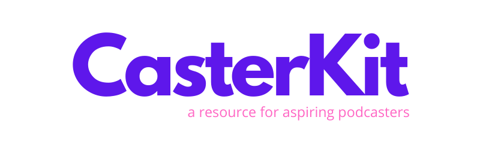

Welcome to CasterKit
=================

We've created this resource because the podcasting ecosystem is growing quickly and it can be intimidating if you're just getting started. We know this, because _we're_ just getting started! Rather than learning by ourselves in a bubble, we figured we would share what we learn so others don't need to start at square one.

Additionally, we recently created the [CasterCommunity](https://castercommunity.com)! A community exclusively for podcasters to network with one another, discuss helpful tips, and share useful resources.

This is our mission, to make it easier for more people to create podcasts. We hope you find this list helpful!

.

_Disclaimer: Some of the links below are affiliate links. That being said, we are not directly affiliated with any of them, and while we have favorites, we don't directly endorse any of them._ 

.

## Table of Contents

* [Microphones](#microphones)
* [Audio Interfaces](#audio-interfaces)
* [Other Accessories](#other-accessories)
* [Podcast Hosting](#podcast-hosting)
* [Recording & Editing Software](#recording--editing-software)
* [Remote Recording Software](#remote-recording-software)
* [Podcast Discovery](#podcast-discovery)
* [Advertising](#advertising)
* [Analytics](#analytics)
* [Audiogram Creator](#audiogram-creator)
* [Transcription](#transcription)
* [Music & Sound Effects](#music--sound-effects)
* [Headphones](#headphones)
* [Guest Booking](#guest-booking)
* [Video Equipment](#video-equipment)
* [Other Services](#other-services)
* [Audience Support](#audience-support)
* [Wordpress Themes](#wordpress-themes)
* [Wordpress Plugins](#wordpress-plugins)
* [Website Hosting](#website-hosting)
* [Newsletter](#newsletter)
* [Social Media Management](#social-media-management)
* [Image Editing](#image-editing)
* [Podcasting Online Courses](#podcasting-online-courses)
* [Podcasting Books](#podcasting-books)

.

---

#### Microphones

* [AKG Perception 220 Professional](https://amzn.to/2U7oUBc)
* [AKG Pro Audio Condenser](https://amzn.to/2UI993O)
* [Aston Stealth Broadcast Quality](https://amzn.to/2QQZB4r)
* [Audio-Technica ATR2100-USB Cardioid Dynamics XLR](https://amzn.to/2UuiA5t)
* [Audio-Technica ATR2500-USB Cardioid](https://amzn.to/2QBSNqY)
* [AT2020 Cardioid Studio XLR](https://amzn.to/33Jknbm)
* [Deity S-Mic 2](https://amzn.to/3eazYFu)
* [Fifine Metal](https://amzn.to/2WzdZSc)
* [Heil PR40](https://amzn.to/3dZi08P)
* [HyperX Quadcast](https://amzn.to/3dezduN)
* [MXL 990 XLR](https://amzn.to/2xM7cum)
* [NT1-A](https://amzn.to/2UsxMA5)
* [PR-40 Dynamic Studio](https://amzn.to/2UaGAMj)
* [Procaster Broadcast Dynamic Vocal](https://amzn.to/33IjIXx)
* [Razer Seiren Elite](https://amzn.to/2UaqlPq)
* [Rode Podcaster mic](https://amzn.to/2WAb7EU)
* [Rode smartLav+](https://amzn.to/34jkqeg)
* [Samson G-Track Pro](https://amzn.to/3c6d4NE)
* [Samson Go Portable](https://amzn.to/3diq7gt)
* [Samson Q2U](https://amzn.to/39avmeW)
* [Senheiser MKH416](https://amzn.to/33IjUpJ)
* [Shure MV88 iOS Digital](https://amzn.to/2UqHX8p)
* [Shure SM58-LC](https://amzn.to/3bToPqE)
* [Shure SM7B](https://amzn.to/3c2ur1W)
* [Snowball Ice](https://amzn.to/2ws0tFu)
* [Yeti Blue](https://amzn.to/33zykIM)
* [Zoom H6 6-Track Portable Recorder](https://amzn.to/33Ij8Jl)

#### Audio Interfaces

* [Antelope Audio Zen Tour](https://amzn.to/2UqOIai)
* [Apogee Element 46](https://amzn.to/2QFdQcc)
* [Arturia AudioFuse](https://amzn.to/2UeOHaK)
* [Audient iD4](https://amzn.to/3a9dWAC)
* [Audient Sono](https://amzn.to/2vIyyAR)
* [BEHRINGER U-PHORIA UMC202HD](https://amzn.to/3adQkuL)
* [DBX 286S Preamplifier](https://amzn.to/2J6rC3u)
* [Focusrite Scarlett 2i2](https://amzn.to/2WxK50S)
* [IK Multimedia AXE I/O](https://amzn.to/2WC6bPS)
* [IK Multimedia iRig Pro Duo](https://amzn.to/33CwAOY)
* [Mackie Onyx Producer 2.2](https://amzn.to/2xgKv0Y)
* [MOTU M2 2x2](https://amzn.to/2WA66Mm)
* [Native Instruments Komplete Audio 1 & Audio 2](https://amzn.to/33Q3hst)
* [RME Fireface UFX II](https://amzn.to/2UpxSbS)
* [Steinberg UR22C](https://amzn.to/39duXsj)
* [Universal Audio Apollo Twin X DUO](https://amzn.to/2QFAUYl)

#### Other Accessories

* [Blue Yeti Foam Cover Pop Filter, Windscreen, 3-in-1](https://amzn.to/3diZk3z)
* [EJT Microphone Pop Filter](https://amzn.to/3bjd2Sl)
* [InnoGear Microphone Stand, Windscreen, Pop Filter](https://amzn.to/3dhVK9Y)
* [Microphone Isolation Shield](https://amzn.to/2WGYbwK)
* [Pyle Recording Shield Box-Microphone Foam Booth Cube](https://amzn.to/2Uwh2Ir)
* [RODE PSA 1 Swivel Mount](https://amzn.to/2vMyZtY)
* [Samson MBA38 Boom Arm](https://amzn.to/2J7oqVh)

#### Podcast Hosting

* [Acast](https://www.acast.com?ref=casterkit)
* [Anchor](https://anchor.fm?ref=casterkit)
* [ART19](http://art19.com?ref=casterkit)
* [Audioboom](https://audioboom.com?ref=casterkit)
* [Ausha](https://www.ausha.co?ref=casterkit)
* [bCast](https://bcast.fm/?via=dan)
* [Blubrry](https://blubrry.com?ref=casterkit)
* [Buzzsprout](https://www.buzzsprout.com/?referrer_id=890707&ref=casterkit)
* [Captivate](https://www.captivate.fm/signup?ref=danschoonmaker1)
* [Castos](https://castos.com/?salescamp=JoLQrQCzgG6chan4R8KMqH1x&ref=casterkit)
* [Djpod](https://djpod.com?ref=casterkit)
* [Fireside](https://fireside.fm?ref=casterkit)
* [Fusebox](https://spilabs.samcart.com/referral/fusebox-web/Xf3THLYssMPfhp64?ref=casterkit)
* [Hipcast](https://www.hipcast.com?ref=casterkit)
* [iVoox](https://www.ivoox.com?ref=casterkit)
* [Libsyn](https://libsyn.com?ref=casterkit)
* [Megaphone](https://www.megaphone.fm?ref=casterkit)
* [OmnyStudio](https://omnystudio.com?ref=casterkit)
* [Pinecast](https://www.pinecast.com?ref=casterkit)
* [Pitch](https://www.getpitch.io?ref=casterkit)
* [Podbean](https://www.podbean.com/clipps?ref=casterkit)
* [Podcast Machine](http://podcastmachine.com?ref=casterkit)
* [Podcast.co](https://www.podcast.co?ref=casterkit)
* [Podcasts.com](https://www.podcasts.com?ref=casterkit)
* [Podcaster.de](https://www.podcaster.de?ref=casterkit)
* [PodcastWebsites](https://podcastwebsites.com?ref=casterkit)
* [Podiant](https://podiant.co?ref=casterkit)
* [Podigee](https://www.podigee.com?ref=casterkit)
* [Podmio](https://podmio.com?ref=casterkit)
* [Podomatic](https://www.podomatic.com?ref=casterkit)
* [PodServe](https://www.podserve.fm?ref=casterkit)
* [RedCircle](https://redcircle.com?ref=casterkit)
* [RSS.com](https://rss.com?ref=casterkit)
* [ShoutEngine](https://shoutengine.com?ref=casterkit)
* [Simplecast](https://simplecast.com?ref=casterkit)
* [Soundcloud](https://soundcloud.com/for/podcasting?ref=casterkit)
* [Spreaker](https://www.spreaker.com?ref=casterkit)
* [Transistor.fm](https://transistor.fm/?via=casterkit)
* [Whooshkaa](https://whooshkaa.com?ref=casterkit)

#### Recording & Editing Software

* [Acoustica](https://acondigital.com/products/acoustica-audio-editor)
* [Adobe Audition](https://www.adobe.com/products/audition.html)
* [Alitu](https://alitu.com)
* [Audacity](https://www.audacityteam.org)
* [Audio Cutter Pro](https://audio-cutter.com/)
* [Bear Audio Tool](https://www.bearaudiotool.com)
* [Fl Studio](https://www.image-line.com/flstudio)
* [Garageband](https://www.apple.com/ca/mac/garageband/)
* [HyaWave](https://wav.hya.io/#/fx)
* [Logic Pro X](https://apps.apple.com/app/logic-pro-x/id634148309)
* [MixPad Multitrack Recording Software](https://www.nch.com.au/mixpad/index.html)
* [Ocenaudio](http://www.ocenaudio.com/en/startpage)
* [Qtractor](https://qtractor.sourceforge.io/qtractor-index.html)
* [Reaper](https://www.reaper.fm?ref=casterkit)
* [Resoundly](https://resound.ly?ref=casterkit)
* [ScreenFlow](http://www.telestream.net/screenflow/overview.htm)
* [Soundation](https://soundation.com)
* [Twisted Wave Online](https://twistedwave.com/online)
* [WavePad](https://www.nch.com.au/wavepad)
* [Wavosaur](https://www.wavosaur.com)
* [Wondershare Filmora](https://filmora.wondershare.com/video-editor)

#### Remote Recording Software

* [Cast](https://tryca.st?ref=casterkit)
* [Cleanfeed](https://cleanfeed.net/)
* [ClearCast](https://clearcast.io?ref=casterkit)
* [Fusioncast.fm](https://fusioncast.fm?ref=casterkit)
* [ipDTL](https://ipdtl.com/)
* [Remotely](https://remotely.fm)
* [Ringr](https://www.ringr.com)
* [Riverside.fm](https://Riverside.fm?ref=casterkit)
* [Skype](https://www.skype.com)
* [Soundtrap for Storytellers](https://www.soundtrap.com/storytellers)
* [SquadCast](https://squadcast.fm/?ref=danschoonmaker2)
* [Zencastr](https://zencastr.com?ref=casterkit)
* [Zoom](https://zoom.us?ref=casterkit)

#### Podcast Discovery

* [Breaker](https://www.breaker.audio?ref=casterkit)
* [Castbox](https://castbox.fm?ref=casterkit)
* [Clipps](https://clip.ps?ref=casterkit)
* [DiscoverPods](https://discoverpods.com?ref=casterkit)
* [Earbud.fm](http://earbud.fm?ref=casterkit)
* [Expodition App](https://apps.apple.com/gb/app/expodition/id1426139575?ref=casterkit)
* [Gritly](https://gritly.co?ref=casterkit)
* [HeadlinerFlix](https://headlinerflix.com?ref=casterkit)
* [iTunes](https://itunes.com?ref=casterkit)
* [ListenNotes](https://listennotes.com?ref=casterkit)
* [Overcast](https://overcast.fm?ref=casterkit)
* [Phenopod](https://phenopod.com?ref=casterkit)
* [Podbay.fm](https://podbay.fm?ref=casterkit)
* [Podcast Gang](https://podcastgang.com?ref=casterkit)
* [Podcast Notes](https://podcastnotes.org?ref=casterkit)
* [Podcatr](https://podcatr.com?ref=casterkit)
* [Podchaser](https://www.podchaser.com/?ref=casterkit)
* [PodFinder](https://www.messenger.com/t/thepodfinder?ref=casterkit)
* [Podfollow](https://podfollow.com?ref=casterkit)
* [PodHound](https://podhound.co/?ref=casterkit)
* [PodHunt](https://podhunt.app?ref=casterkit)
* [Podible](https://podible.co/?ref=casterkit)
* [Podly](http://get.podly.io?ref=casterkit)
* [PodSearch](https://podsearch.com?ref=casterkit)
* [Podyssey](https://podyssey.fm?ref=casterkit)
* [Repod](https://repod.io/?ref=casterkit)
* [Riptide](https://riptide.fm/?ref=casterkit)
* [Spkr](https://www.spkr.com?ref=casterkit)
* [Spotify](https://spotify.com?ref=casterkit)
* [Stitcher](https://www.stitcher.com?ref=casterkit)
* [Swoot](https://swoot.com?ref=casterkit)

#### SEO

* [Podr](https://podr.co/)
* [Neil Patel](https://neilpatel.com/blog/podcast-seo/)

#### Advertising

* [Advertisecast](https://www.advertisecast.com?ref=casterkit)
* [Audiogo](https://www.audiogo.com?ref=casterkit)
* [Authentic](http://authenticshows.com?ref=casterkit)
* [iHeartRadio Ad Network](https://news.iheart.com/advertise?ref=casterkit)
* [Spotify Ad Studio](https://adstudio.spotify.com?ref=casterkit)

#### Analytics

* [Backtracks](https://backtracks.fm?ref=casterkit)
* [Chartable](https://chartable.com?ref=casterkit)
* [PodcastKit](https://www.podcastkit.co?ref=casterkit)
* [Podcorn](https://podcorn.com?ref=casterkit)
* [Podsights](https://podsights.com?ref=casterkit)
* [Podtrac](http://podtrac.com?ref=casterkit)
* Most [hosting](#podcast-hosting) services also provide analytics

#### Audiogram Creator

* [Bullet (iOS)](http://bullet.audio?ref=casterkit)
* [Castro (iOS)](https://castro.fm?ref=casterkit)
* [Clippa.co](https://clippa.co?ref=casterkit)
* [GetAudiogram](https://getaudiogram.com?ref=casterkit)
* [Headliner](https://www.headliner.app?ref=casterkit)
* [Overcast (iOS)](https://overcast.fm?ref=casterkit)
* [Podcast Video Maker (mobile)](http://onelink.to/bw3bbc?ref=casterkit)
* [Vivid.fm](https://vivid.fm?ref=casterkit)
* [Wavve](https://wavve.co?ref=casterkit)

#### Transcription

* [Auphonic](https://auphonic.com?ref=casterkit)
* [Castos](https://castos.com/transcription?ref=casterkit)
* [Castup](https://useCastup.com?ref=CasterKit)
* [Descript](https://www.descript.com?ref=casterkit)
* [GMR Transcription](https://www.gmrtranscription.com?ref=casterkit)
* [GoTranscript](https://gotranscript.com?ref=casterkit)
* [Happy Scribe](https://www.happyscribe.co?ref=casterkit)
* [Plotcast](https://plotcast.co/?ref=casterkit)
* [PodReacher](https://podreacher.com?ref=casterkit)
* [Rev](https://www.rev.com/transcription?ref=casterkit)
* [Scribie](https://scribie.com?ref=casterkit)
* [Sonix](https://sonix.ai?ref=casterkit)
* [Temi](https://www.temi.com?ref=casterkit)
* [TranscribeMe](https://www.transcribeme.com?ref=casterkit)
* [Transcription Star](https://www.transcriptionstar.com?ref=casterkit)
* [Transcripty](https://transcripty.com?ref=casterkit)
* [Trint](https://trint.com?ref=casterkit)
* [YouTube](https://youtube.com)([how-to guide](https://youtube.com/watch?v=jnVSyBY5yYc))
* [zpoken.ai](https://transcribe.zpoken.ai/?ref=CasterKit)

#### Music & Sound Effects

* [909 Music on Soundcloud](https://soundcloud.com/909-music)
* [Artlist](https://artlist.io)
* [Audiojungle](https://audiojungle.net)
* [Audionautix](https://audionautix.com)
* [Epidemic Sound](https://www.epidemicsound.com)
* [Free Music Archive](http://freemusicarchive.org)
* [Free PD](https://freepd.com)
* [Freesound](https://freesound.org/browse)
* [Icons8](https://icons8.com/music)
* [Incompetech](https://incompetech.com/music)
* [Pond5](https://www.pond5.com/royalty-free-music)
* [Premium Beat](https://www.premiumbeat.com/royalty-free/podcast-music)
* [Purple Planet](https://www.purple-planet.com)
* [Shutterstock](https://www.shutterstock.com/music)
* [Silverman Sound Studios](https://www.silvermansound.com/free-music)
* [Soundbible](http://soundbible.com)
* [ZapSplat](https://www.zapsplat.com/sound-effect-categories)

#### Headphones

* [1More Triple Driver In-Ear](https://amzn.to/2WIUiaZ)
* [Audio-Technica ATH-M50x Pro](https://amzn.to/2J6cxyU)
* [Beyerdynamic DT 1990 Pro](https://amzn.to/2QCBm9M)
* [Bose Noise Cancelling 700](https://amzn.to/2QGsNL4)
* [Focal Stellia](https://amzn.to/2WAmQ6b)
* [Grado SR60e](https://amzn.to/2Uxuv2q)
* [Jabra Elite 85h](https://amzn.to/2UtrErv)
* [JBL Live 650BTNC](https://amzn.to/39eETS2)
* [Optoma NuForce BE Sport4](https://amzn.to/39a1Sh5)
* [Plantronics BackBeat Go 810](https://amzn.to/2xV9GGC)
* [RHA S500u](https://amzn.to/2J9crqi)
* [Sennheiser HD 450BT](https://amzn.to/2UtrCzT)
* [Sony WF-1000XM3](https://amzn.to/33Q5PH3)
* [Sony WH-1000XM3](https://amzn.to/3abjACs)
* [Urbanears Plattan II](https://amzn.to/3adEtNj)

#### Guest Booking

* [CastSpot](https://castspot.io?ref=casterkit)
* [Podchaser Connect](https://www.podchaser.com/connect?ref=casterkit)
* [PodGuest](https://podguest.me?ref=casterkit)
* [Kitcaster](https://kitcaster.com?ref=casterkit)

#### Video Equipment

* [Canon PowerShot SX70 HS Digital Camera](https://amzn.to/2RvFcC7)
* [Logitech C922 Pro Stream Webcam 1080P Camera](https://amzn.to/3cgCTuN)
* [Lume Cube](http://lumecube.refr.cc/danschoonmaker)
* [Manfrotto 290 Light Aluminum 3-Section Tripod](https://amzn.to/2UYiQey)
* [Neewer Camera Photo/Video LED Ring](https://amzn.to/3a0DWgN)
* [Sony Alpha A6600 Mirrorless Camera](https://amzn.to/3b3HzUj) ([Bundle](https://amzn.to/2wwdOwu))
* [Sony - FE 50mm F1.8 Standard Lens](https://amzn.to/2Xu88OO)
* [Sony RX100 VI 20.1 MP Premium Compact Digital Camera](https://amzn.to/2RxjpKp)

#### Other Services

* [Podbites](https://www.podbites.fm?ref=casterkit)
* [Podcast Cover Art](https://thegrowingpodcasts.com?ref=casterkit)
* [PodcastMotor](https://www.podcastmotor.com/)

#### Audience Support

* [Chargebee](https://www.chargebee.com?ref=casterkit)
* [Indigogo](https://indigogo.com?ref=casterkit)
* [Kickstarter](https://kickstarter.com?ref=casterkit)
* [Liberapay](https://liberapay.com?ref=casterkit)
* [Memberful](https://memberful.com?ref=casterkit)
* [Patreon](https://patreon.com?ref=casterkit)
* [Podia](https://www.podia.com?ref=casterkit)

#### Wordpress Themes

* [Amplify - UpThemes](https://upthemes.com/themes/amplify-theme)
* [Beat - CSSIgniter](https://www.cssigniter.com/members/aff/go/schoonlabs?i=375)
* [Berliner - CSSIgniter](https://www.cssigniter.com/members/aff/go/schoonlabs?i=120)
* [Bolden - SecondLine](https://secondlinethemes.com/theme/bolden-wordpress-theme/)
* [Divi - Elegant Themes](https://www.elegantthemes.com/affiliates/idevaffiliate.php?id=20491&url=43407)
* [Dixie - SecondLine](https://secondlinethemes.com/theme/dixie-wordpress-podcast-theme/ref/119/?campaign=CasterKit)
* [Gumbo - SecondLine](https://secondlinethemes.com/theme/gumbo-wordpress-podcast-theme/ref/119/?campaign=CasterKit)
* [Indigo - Artisan Themes](https://artisanthemes.io/wordpress-themes/indigo/?ref=SchoonLabs&campaign=CasterKit)
* [Medias - Mojo Marketplace](http://www.mojomarketplace.com/item/medias)
* [Moment - CSSIgniter](https://www.cssigniter.com/members/aff/go/schoonlabs?i=170)
* [Music - Themify](https://themify.me/member/aff/go/schoonlabs?cr=aHR0cDovL3RoZW1pZnkubWUvdGhlbWVzL211c2lj)
* [Obsidian - AudioTheme](https://audiotheme.com/view/obsidian)
* [Oscillator - CSSIgniter](https://www.cssigniter.com/members/aff/go/schoonlabs?i=198)
* [Oxium - CSSIgniter](https://www.cssigniter.com/members/aff/go/schoonlabs?i=227)
* [Promenade - AudioTheme](https://audiotheme.com/view/promenade)
* [Satchmo - SecondLine](https://secondlinethemes.com/theme/satchmo-wordpress-theme/ref/119/?campaign=CasterKit)
* [Sessions](https://www.cssigniter.com/members/aff/go/schoonlabs?i=183)
* [Tusant - SecondLine](https://secondlinethemes.com/theme/tusant-wordpress-theme/ref/119/?campaign=CasterKit)
* [Ultra - Themify](https://themify.me/member/aff/go/schoonlabs?cr=aHR0cHM6Ly90aGVtaWZ5Lm1lL3RoZW1lcy91bHRyYQ%3D%3D)

#### Wordpress Plugins

* [As Heard On](https://wordpress.org/plugins/as-heard-on)
* [Buzzsprout Podcasting](https://wordpress.org/plugins/buzzsprout-podcasting)
* [Featured Podcast Widget](https://wordpress.org/plugins/featured-podcast-widget)
* [Fusebox Player](https://fusebox.fm/#fusebox-player)
* [Libsyn Podcasting Plugin](https://wordpress.org/plugins/libsyn-podcasting)
* [Memberful WP](https://wordpress.org/plugins/memberful-wp)
* [Patreon Wordpress](https://wordpress.org/plugins/patreon-connect)
* [Podcast Subscribe Buttons](https://wordpress.org/plugins/podcast-subscribe-buttons)
* [Podlove Podcast Publisher](https://wordpress.org/plugins/podlove-podcasting-plugin-for-wordpress)
* [Powerpress](https://create.blubrry.com/resources/powerpress)
* [Seriously Simple Podcasting](https://wordpress.org/plugins/seriously-simple-podcasting)
* [Simple Podcast Press](https://simplepodcastpress.com)
* [Simple Podcasting](https://wordpress.org/plugins/simple-podcasting)

#### Website Hosting

* [Bluehost](https://www.bluehost.com/track/casterkit/)
* [GoDaddy](https://godaddy.com)
* [Squarespace](http://squarespace.com/)
* [Wordpress.org](https://wordpress.org)

#### Newsletter

* [ConvertKit](https://convertkit.com)
* [Mailchimp](https://mailchimp.com)
* [PodBoxer](https://podboxer.com/)

#### Social Media Management

* [Buffer](https://hootsuite.com)
* [Hootsuite](https://hootsuite.com)
* [Iconosquare](https://iconosquare.com/)
* [Later](https://later.com)
* [MavSocial](https://mavsocial.com/)
* [MeetEdgar](https://meetedgar.com/)
* [Sendible](https://www.sendible.com/)
* [Sprout Social](https://sproutsocial.com/)
* [Tailwind](https://www.tailwindapp.com/)

#### Image Editing

* [Canva](https://canva.com?ref=casterkit)

#### Podcasting Online Courses

* [1+1 = Podcast: A Simple Formula for Podcasting Success](https://www.udemy.com/course/one-plus-one-equals-podcast-a-simple-formula-for-podcasting-success/)
* [How To Start A Podcast](https://www.udemy.com/course/makeapodcast/)
* [How to Start a Podcast - Podcasting Made Easy](https://www.udemy.com/course/powerpodcasters/)
* [How to Write a Sponsorship Proposal that Earns](https://www.udemy.com/course/how-to-write-a-sponsorship-proposal/)
* [Improve Your Speaking Voice to Teach Online or Podcast](https://www.udemy.com/course/how-to-improve-your-voice-to-teach-an-awesome-online-course/)
* [Music Production in Logic Pro X](https://www.udemy.com/course/thecompletelogicprox/)
* [Podcast: The top 8 ways to monetize by Podcasting](https://www.udemy.com/course/monetizeyourpodcast/)
* [Podcast Coach: Podcasting Profits](https://www.udemy.com/course/podcasting-profits-coaching-for-dollars/)
* [The Podcast Masterclass: The Complete Guide to Podcasting](https://www.udemy.com/course/podcasting-masterclass)

#### Books

* [Atomic Habits: An Easy & Proven Way to Build Good Habits & Break Bad Ones](https://amzn.to/2VkUqLd)
* [Creative, Inc.: The Ultimate Guide to Running a Successful Freelance Business](https://amzn.to/34vs1qg)
* [Crushing It!: How Great Entrepreneurs Build Their Business and Influence-and How You Can, Too](https://amzn.to/34uOSSG)
* [Rise of the Youpreneur: The Definitive Guide to Becoming the Go-To Leader in Your Industry and Building a Future-Proof Business](https://amzn.to/2RuHAcl)
* [Superfans: The Easy Way to Stand Out, Grow Your Tribe, and Build a Successful Business](https://amzn.to/3efY024)
* [The Thank You Economy](https://amzn.to/2xmh2mK)
* [Tribe of Mentors: Short Life Advice from the Best in the World](https://amzn.to/3b5bFHk)
* [Vlog Like a Boss: How to Kill It Online with Video Blogging](https://amzn.to/2XuOdir)

.

----
. 

We realize this is definitely not an exhaustive list of all of the tools available, and are working on adding more. If you have any tools/services you would like to recommend, please fill out this form: https://casterkit.typeform.com/to/BKndas 
